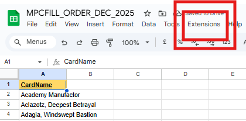
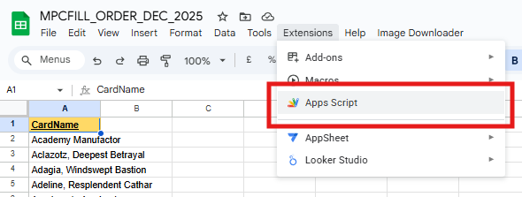
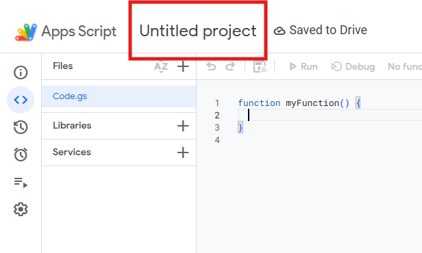
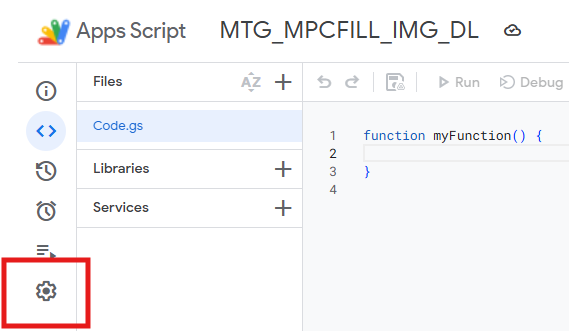
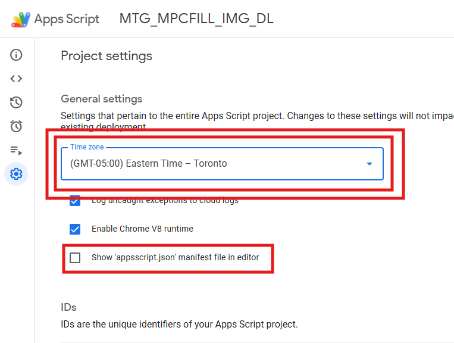
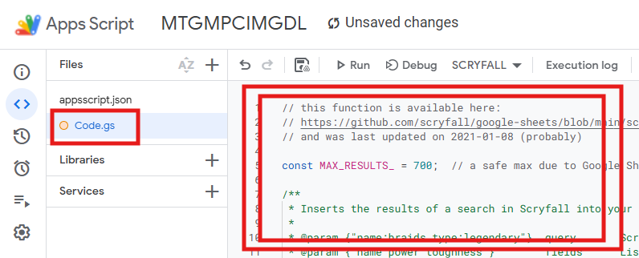
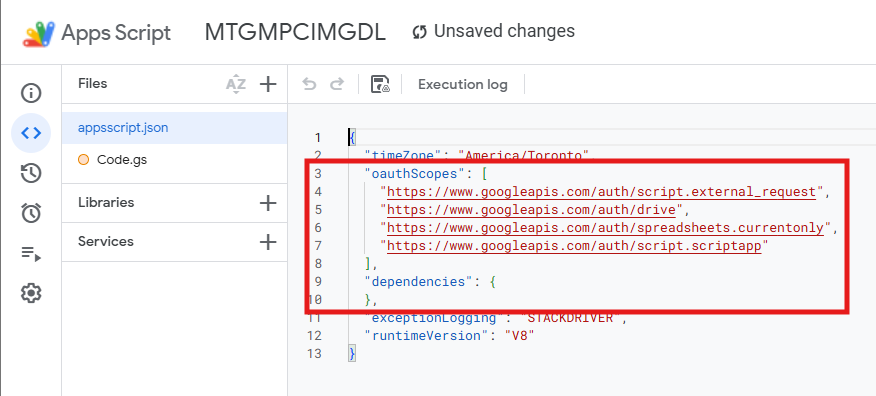
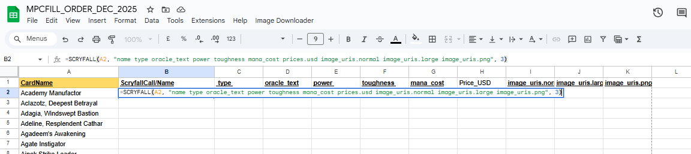
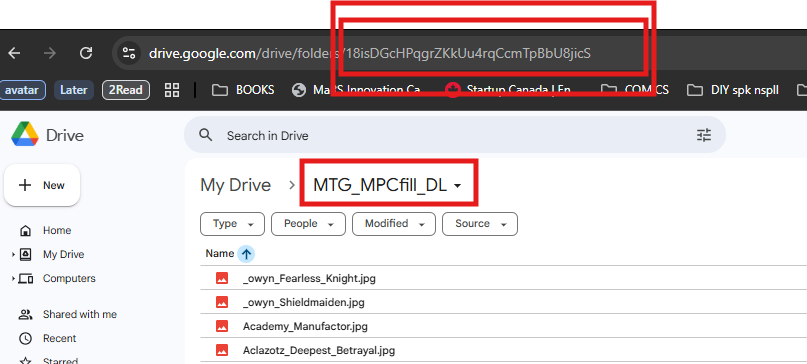
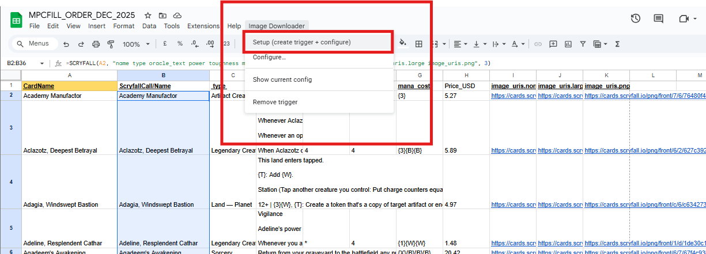

# Image Downloader for Google Sheets

An automatic image downloader from cells containing image URLs packaged with a forked version of a google sheets custom function for the scryfall api. This is for placing orders of MTG proxy orders on MPCfill (https://mpcfill.com/editor).

# USAGE
The Scryfall() GS function can be used to pull out image urls, eg. 
You can see some exaple fields in this cards json body: https://api.scryfall.com/cards/4dcdcad5-e4fb-480e-984f-1ac5cdc986b9?format=json&pretty=true

=SCRYFALL(\<Cell address with your card name or card search query\>, \<A String of space separated Scryfall Field names\>, <Max Number of results returned (Each gets its own line below where this is called)>)

=SCRYFALL(A2, "name type oracle_text power toughness mana_cost prices.usd image_uris.normal image_uris.large image_uris.png", 3)

## Full SCRYFALL() argument list

```
=SCRYFALL(query, fields, num_results, order, dir, unique, wait, headers)
```

| # | Arg | Type | Default | Notes |
|---|-----|------|---------|-------|
| 1 | `query` | string | (required) | Scryfall search query |
| 2 | `fields` | string | `"name"` | Space- or comma-separated field names. Pass `"*"` for all fields |
| 3 | `num_results` | number | `150` | Max 700 |
| 4 | `order` | string | `"name"` | Scryfall sort order |
| 5 | `dir` | string | `"auto"` | `auto`, `asc`, or `desc` |
| 6 | `unique` | string | `"cards"` | `cards`, `art`, or `prints` |
| 7 | `wait` | number | `0` | Seconds to delay before the API call. **Max 20** — Google Sheets custom functions hard-timeout at 30s |
| 8 | `headers` | boolean | `false` | When `true`, prepend a header row of field names |

Use `=SCRYFALL_FIELDS("query")` to list every available field name for a card.

### About `wait` — what it is and isn't

`wait` is a **per-cell** delay, not a cross-row rate limiter. Google Sheets evaluates custom functions in parallel, so 500 cells with `=SCRYFALL(..., 5)` all wait 5 seconds and then hit the API simultaneously — that won't avoid 429 rate-limit errors. For large sheets, use **Batch Mode** (below). Passing values above 20 will throw a clear error instead of silently hanging the cell.

---

## Batch Mode (for large sheets)

The `=SCRYFALL()` formula runs in parallel across cells, which trips Scryfall's 10 req/sec rate limit on sheets with hundreds of rows. The **Image Downloader → Batch SCRYFALL** menu runs Scryfall calls **sequentially** in a single execution, with a randomized 110–350 ms gap between requests by default.

### Setup

1. Open the **Image Downloader** menu and click **Batch SCRYFALL → Configure batch…**
2. You'll be asked for:
   - **Batch query column** — column number containing the card name / Scryfall query in each row
   - **Batch output column** — column number where results start (fields are written rightward)
   - **Batch fields** — space- or comma-separated Scryfall field names (e.g. `name image_uris.large prices.usd`)
   - **Min wait (ms)** — minimum sleep between requests (default 110)
   - **Max wait (ms)** — maximum sleep between requests (default 350)

### Run

Click **Image Downloader → Batch SCRYFALL → Run batch now**. The script:

- Reads queries from the configured column starting one row below your header row
- Calls Scryfall one row at a time (single result per query)
- Writes the chosen fields into the output column
- Sleeps a random amount between min/max ms between calls
- Toasts progress every 25 rows
- Auto-retries on transient 429s (up to 3 retries, 60+s backoff)

### Limits

- Apps Script menu functions have a **6-minute** total runtime. With default 110–350 ms gaps, that's roughly 1,000–2,500 rows per run. Split larger sheets into chunks and re-run.
- Empty rows in the query column are skipped.
- Per-row fetch errors are written into the output cell as `ERROR: …` so you can resume manually.

The Image Downloader Trigger gets called when the column specified in the setup config is edited - so copying and pasting the column will trigger the downloads. The above example puts the 'large' images in the 9th column of the results, so in my case it would be 10 because of the reference column A before the results.

## What this does

When you paste image URLs into a specific column, the script automatically downloads each image to a Google Drive folder you choose.

It supports:

- Single-cell edits
- Multi-row copy/paste
- Automatic operation after setup

---

## One-Time Setup (Required)

### 1) Creating the sheet script
First click on the extensions menu and navigate to the 'Apps Script' button.




Now Name your script



Navigate to script settings page



Ensure you have the correct timezone selected - this can impact api calls. And also select the 'show appscript.json manifest' check box.



Navigate back to the script tab, and copy in the Code.gs file



In the appsscript.json folder, allow for Oauth by pasting in the scopes - keep all other parameters in your own file. 



Apply your Scryfall call to get the image urls.



Copy the Google Drive Folder ID you'll be using to store the images



### 3) Run Setup

Setup the image downloader script. If you don't see this menu after saving your script, try refreshing the page.



Click:

**Image Downloader → Setup (create trigger + configure)**

You will be asked for four values:

- **Sheet name**
  - The exact name of the tab containing your image URLs
  - Example: `Sheet1` or `Cards`

- **URL column number**
  - The column that contains the image URLs
  - Column A = 1, B = 2, C = 3, etc.

- **Drive folder ID**
  - Open Google Drive
  - Navigate to the folder where images should be saved
  - Copy the ID from the URL:

    `https://drive.google.com/drive/folders/XXXXXXXXXXXX`

    Copy only the `XXXXXXXXXXXX` part

- **Header row**
  - Row number of your header row
  - Rows at or above this number will be ignored
  - Use `1` for a single header row, or `0` if you have no headers

### 4) Authorize the script

Google will prompt you to approve permissions:

- Read spreadsheet edits
- Download files from the internet
- Save files to Google Drive

Click **Allow**.

This only happens once.

---

## How to Use (After Setup)

### Paste URLs into the configured column

- Paste one URL
- Or paste many rows at once

Each valid image URL will be:

- Downloaded
- Saved as a separate file
- Stored in your chosen Drive folder

No buttons, no formulas, no manual runs needed.

### What triggers a download

- Editing or pasting into the configured URL column
- Multi-row pastes are fully supported

### What does NOT trigger a download

- Editing other columns
- Editing header rows
- Pasting non-URL text

---

## Common Issues & Fixes

### “Nothing happens”

- Confirm you ran **Setup**
- Confirm the correct sheet name and URL column number
- Make sure the pasted value starts with `http://` or `https://`

### “Permission error”

- Re-run **Image Downloader → Setup**
- Approve permissions when prompted

### Duplicate downloads

- The script does not deduplicate by default
- Re-pasting the same URL will download again

(An optional “deduplication by row or card ID” version can be added later.)

---

## Optional Menu Tools

From **Image Downloader** menu:

- **Configure…** — change settings without recreating the trigger
- **Show current config** — verify your setup
- **Remove trigger** — disable automatic downloading

---

## Recommended Workflow (Scryfall users)

- Generate URLs (or paste static values)
- Paste them into the configured URL column
- Images appear automatically in Drive

---

## Support

If something breaks:

- Check **Extensions → Apps Script → Executions**
- Look for red “Failed” runs and read the error message

---

## Future Goals

1) In line card image previews
2) Replace the need to download the MPCFill Desktop application : https://github.com/chilli-axe/mpc-autofill/wiki/Desktop-Tool
